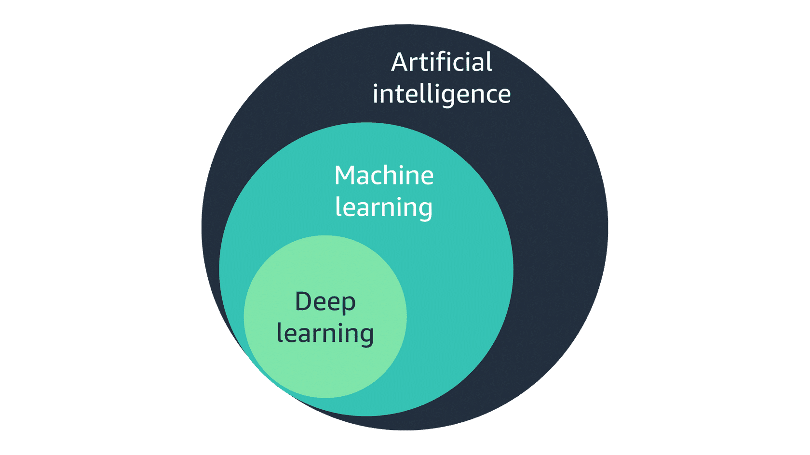
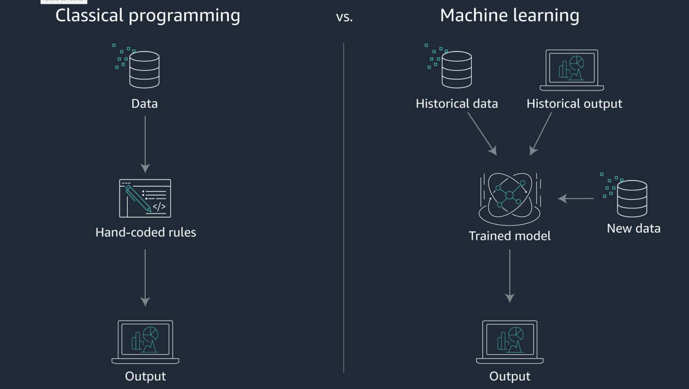
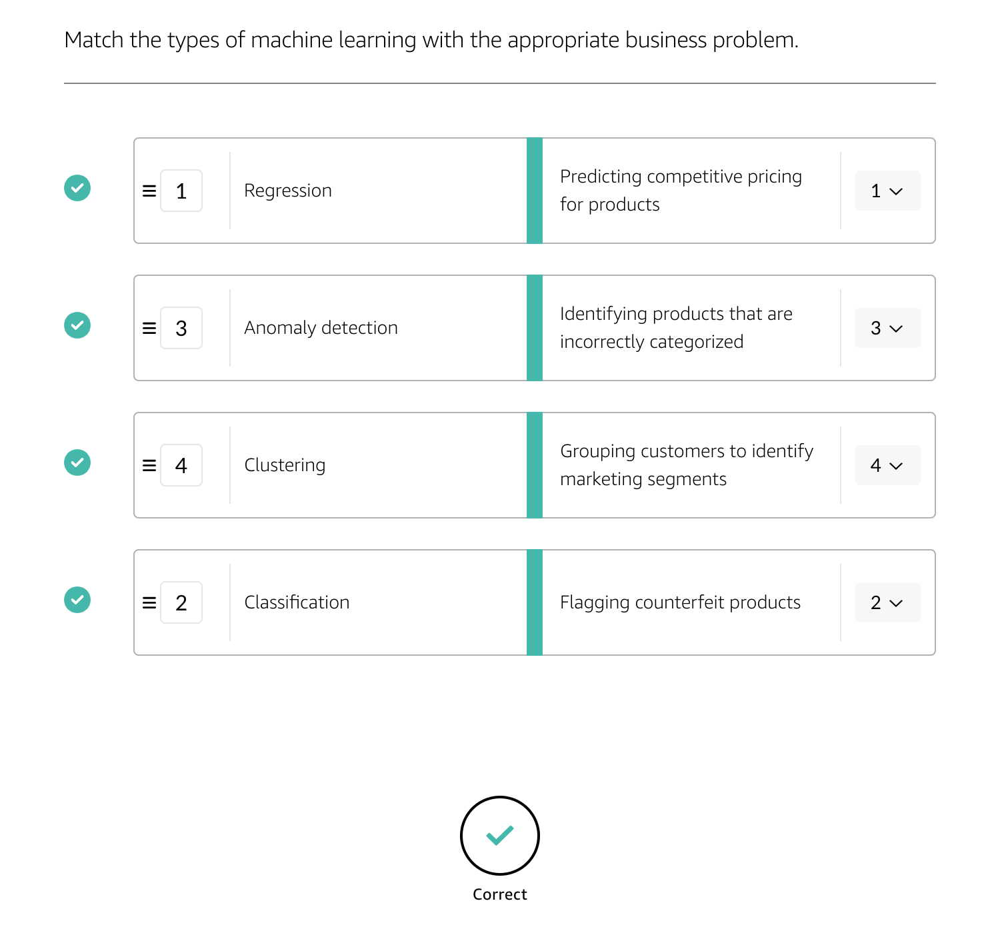

# How does ML work?
## What is artificial intelligence?
Artificial intelligence (AI) is any system that is able to ingest human-level knowledge to automate and accelerate tasks performable by humans through natural intelligence.  

AI has two categories:  
- **narrow**, where AI imitates human intelligence in a single context, and
- **general**, where AI learns and behaves with intelligence across multiple contexts

> Examples of AI include:
> - Intelligent search in _Amazon Kendra_
> - Document analysis in _Amazon Comprehend_
> - Data and Text extraction in _Amazon Textract_

## What is the difference between AI and ML?
- **`AI`** ingests data, such as human-level knowledge, and imitates natural intelligence
  + **`ML`** is a subset of **`AI`**, where data and algorithms continuously improve the training model to help achieve higher-quality output predictions. 
    + **`DL`** is a subset of **`ML`**. It is an approach to realizing `ML` that relies on a layered architecture, mimicking the human brain to identify data patterns and train the model.

## The core components of AI
What are the requirements to implement AI? 
- domain knowledge to structure and frame the problem correctly, 
- high-quality input data to train the model, and 
- methods to detect patterns and make predictions.

## Difference between ML and classical programming
`ML` involves teaching a computer to recognize patterns by example, rather than programming it with specific rules. These patterns can be found in the data.  
In other words, `ML` is about creating algorithms (or set of rules) that learn from complex functions (patterns) from data, and make predictions upon it (a form of "narrow AI").  
`ML` learns from data and can be reused for unseen, future, or new data without rewriting code.  
In other words, with `ML`, you start with a problem, identify data associated with that problem, use an algorithm to, then, model that problem, and generate the output. 

## Categories of ML
There are three major categories of `ML`, depending on the specific use case:
1. **Supervised learning** - is a method where a model learns from a data set containing input values and paired output values that you would like to predict:
- **Classification** — classifying documents
- **Regression** - forecasting demands for a product
2. **Unsupervised learning** - is a method in which the training model learns from data without any guidance. The objective is pattern and structure recognition:
- **Clustering** - Customer segmentation (e.g: Regular, Promising, or Random)
- **Association** - Discovering regularities among products (e.g.: Customers, who usually purchase product `A` will usually purchase product `B` / Customers, who purchase `X` & `Y` will usually purchase `Z`)
3. **Reinforcement learning** - is a method in which the training model learns from its environment by being rewarded for correct moves and punished for incorrect moves (e.g.: autonomous driving)

## Solutions ML can provide
`ML` can provide: 
- predictive solutions (regression and classification),
- prioritization (rankings and scores), and 
- behavior patterns (recommendations and clustering).

## Quiz

