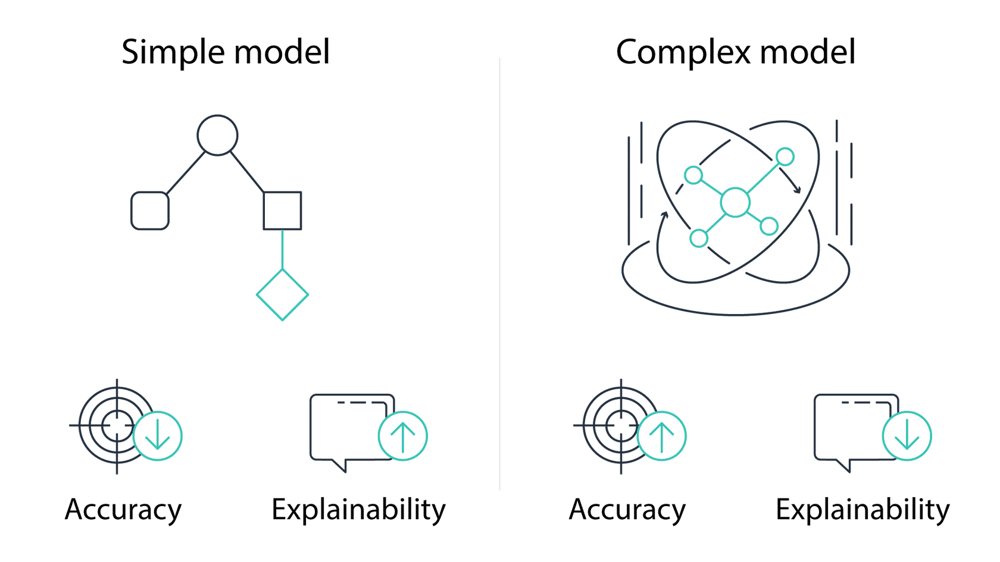

# Potential problems with machine learning
Machine learning modeling can be problematic for learning algorithms due to the ingestion of poor quality data. For example, the data may not include enough samples to represent a broad enough scope of relevant variables.

## Simple and Complex models
Simple and complex `ML` models differ when balancing a model's accuracy (number of correctly predicted data points) and a model's explainability (how much of the `ML` system can be explained in "human terms"). 
### Simple models
The output of a simple `ML` model may be _explainable_ and produce _faster results_, but the results may be _inaccurate_. 

### Complex models
The output of a complex `ML` model may be _accurate_, but the results may be _difficult to communicate_.

---
_Simple models may prioritize output explainability over accuracy. Complex models may prioritize accuracy over output explainability._

## Unexplainabilty
`Unexplainability` represents how much of the reasoning behind an `ML` model's decision cannot be effectively described in human terms. There are potentially legal, professional, ethical, and regulatory conditions where the tolerance for unexplainability may vary from case to case.

### When is it not okay?
- When you need to be able to explain to your Customer what their loan was declined
- When you need to be able to explain ehy a transaction was deemed fraudulent

### When is it okay?
- When risks of misclassification are low, such as object recognition for catalog search or predicting the probability of completing NFL (National Football League) play.
- When humans make the final decisions

## Uncertainty
`Uncertainty` describes an imperfect outcome. In the context of machine learning, uncertainty arises from using models. These models attempt to fit a training data, which may have imperfect data. The "best" data may also be unknowable.

---
_When using ML, estimate the amount of uncertainty a model may have. Compensate to avoid potential misinterpretations of life and property._

## Quiz

ml_art-of-the-possible
