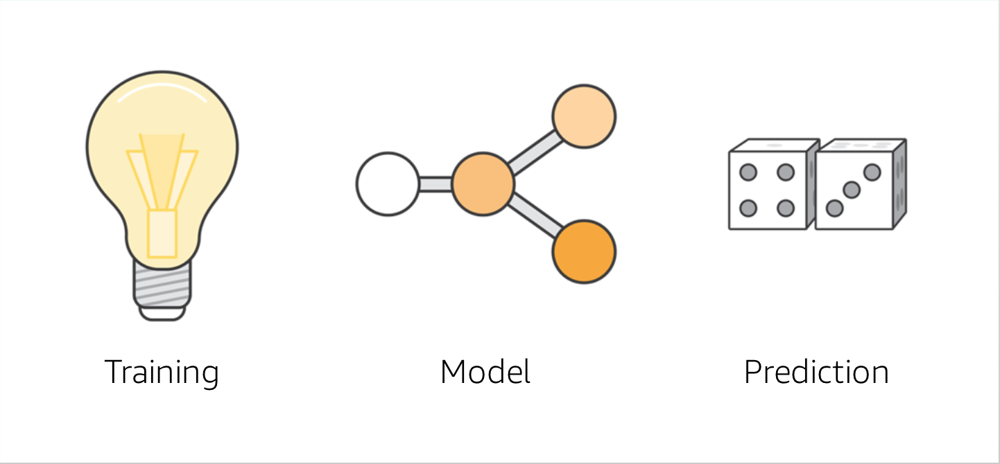
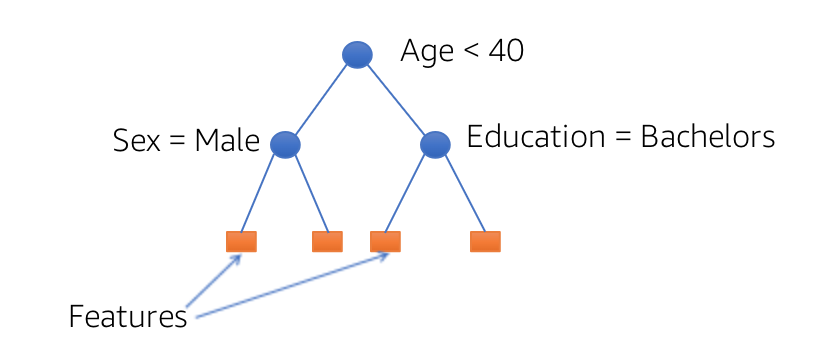
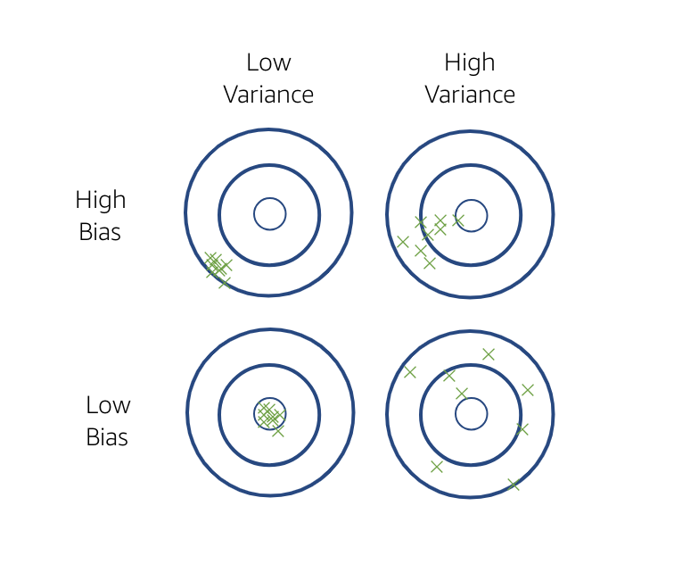
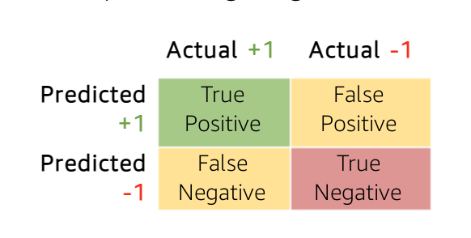
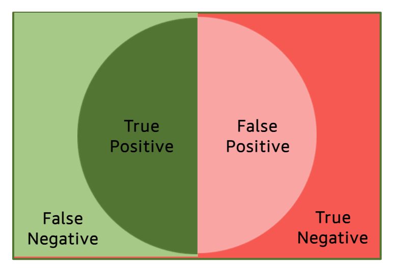
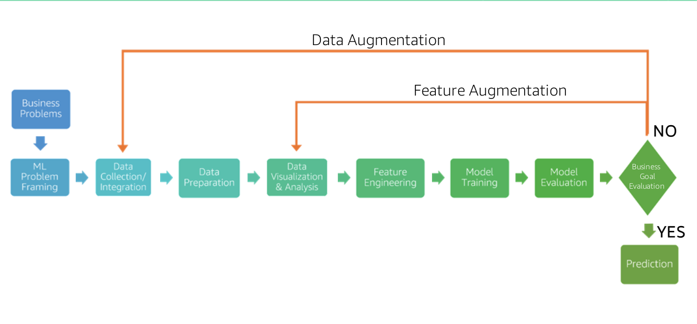

# Machine Learning Terminology
The common terminology in ML:
- Training - the first what machine uses out of the data sets to build its prediction algorithms;
- Model - the algorithms make up the Model, so it is the core of the ML process. It is what your machine creates after it's been trained and refines every time as it learns. Thus it generates a Prediction
- Prediction - is the best machine estimate of how the outputs would be

### Training
Training is split into two processes:
- Training Dataset - is an input into the machine, evaluated by it and used to create the first model.
- Test Dataset - is used to test the dataset for accuracy.

## The Business Problem
### Step 1: ML Problem Framing
ML starting with a business problem, and in the end, it results in a prediction.

###  Step 2: Approach: Questions to Ask
#### Three common types of "Machine Learning" algorithms:
- **Supervised Learning** (С учителем)
  - Classification
  - Regression
- **Unsupervised Learning** (Без учителя)
  - Clustering
  - Dimensionality Reduction
- **Reinforcement Learning** (С подкреплением)

1. Supervised Learning (Обучение с учителем)
  - Classification (Классификация) — предсказывает категории (например, спам/не спам).
  - Regression (Регрессия) — предсказывает числовые значения (например, цену дома).  

_In `Supervised` learning algorithms, we will learn from a historical dataset, where the answer is already known, and we will feed this into ML algorithms to predict the future data points._  

In `Classification` problems there are two fixed categories:
- Binary (2 classes: e.g.: fraud or not fraud)
- Multiclass (3+ classes, e.g.: all the product categories, to which the product could belong)  

To structure the problem:
- Observations (To structure the Output, we can use attributed from the dataset)
- Labels (predicted future outcomes)
- Features (to predict the labels for unseen data

`Example`: Income classification problem (Predict if a person makes more than $50K)  

| Age | Education | Education length | Marital status | Occupation    | Gender  | Label   |
|-----|-----------|------------------|----------------|---------------|---------|-----------|
| 19  | Bachelors | 14               | Single         | Adm-clerical  | male    | <50K (-1)  | 
| 31  | Masters   | 18               | Married        | Engineering   | female  | >= 50K (1) |

---
2. Unsupervised Learning (Обучение без учителя)
  - Clustering (Кластеризация) — группирует данные без меток (например, сегментация клиентов).
  - Dimensionality Reduction (Снижение размерности) — упрощает данные, сохраняя структуру (PCA, t-SNE).  

_In `Unsupervised` learning algorithms, the outcome is not know beforehand, so we let the ML algorithm to choose how to define data and then give us a result_ 

---
3. Reinforcement Learning (Обучение с подкреплением)
  - Система учится на действиях и наградах (например, ИИ для игр или роботов).

_In `Reinforcement` learning algorithms, the algorithm is rewarded based on the choices it makes while learning_

#### 🔥 General differences
- **Supervised** Learning — есть "учитель" (размеченные данные).
- **Unsupervised** Learning — нет меток, ищем скрытые закономерности. 
- **Reinforcement** Learning — обучение через `trial & error`.

### Step 3: Develop Your Dataset
#### Data Collection & Integration
Once the type of ML problem has been determined, we can start developing our Dataset.  
Data can be collected from multiple sources: databases, web, etc. (S3, DynamoDB, Redshift, Web)  
The collected data can be classified into three distinguished types:
- Structured (organized and stored)
- Semi-structured (typically organized in some known formats, e.g. csv, json, ...)
- Unstructured (other data, which has no format or organization to be stored)

### Step 4: Data Preparation
Even when the data is prepared and as whole in one place, it is not quite ready to be used to train a `Model`.
The data found in the real world is very dirty and noisy.
Because of this the data has to go to some steps before it can be used for training. 
Putting our data through these steps results a better accuracy and predictions.
In preparing our data we also convert it into an appropriate format for injection into ML algorithm.

When thinking iof data preparation, it's important to know, that missing feature values and outliers can hurt our Model performance.

`Example`: Table of data having outlier and missing values

| Age | Education | Education length | Marital status | Occupation   | Gender | Label |
|-----|-----------|------------------|----------------|--------------|--------|-------|
| 19  | Bachelors | 14               | Single         | Adm-clerical | male   | 0     | 
| 31  | Masters   | 18               | Married        | Engineering  | female | 1     |
| 44  | Bachelors |                  |                | Accounting   | male   | 0     |
|`150`| Bachelors |                  | Married        | Engineer     | female | 0     |

Thus, there are different techniques to solve this:
- `Introduce` new indicator variable to represent missing value, or
- `Remove` the rows with the missing values, or
- `Imputation` is to fill up the missing values  
_These techniques utilize the best guess of what the data likely is._

#### Imputation
Is a technique that replaces a missing value with a value from a dataset.

#### Shuffle Training Data
- Shuffling results in better model performance for certain algorithms
- Minimizes the risk of cross-validation data by representing the model data AND model data not learning from all type of data.

#### Cross Validation Technique
Test-Validation-Train Split

| Test | Validation | Train |
|------|------------|-------|
| 20%  | 10%        | 70%   |

This technique usually consists of **three** different types:
1. Validation (as shown in the above table)
2. Leave-one-out (LOOCV) - we only ise one data point as our test sample, and we run the training with other examples (Note: it is computationally expensive)
3. K-fold - randomly split the dataset into K-fold. And for each fold we train a Model and record an error

### Step 5: Data Visualization and Analysis
This step is for better understanding of the data, which helps to design better data features.

<table>
  <tr>
    <th colspan="6">Features</th>
    <th>Not a feature</th>
  </tr>
  <tr>
    <td>Age</td><td>Education</td><td>Education length</td>
    <td>Marital status</td><td>Occupation</td><td>Gender</td><td>Label</td>
  </tr>
  <tr>
    <td>19</td><td>Bachelors</td><td>14</td><td>Single</td><td>Adm-clerical</td><td>male</td><td>0</td>
  </tr>
  <tr>
    <td>31</td><td>Bachelors</td><td>18</td><td>Married</td><td>Engineering</td><td>female</td><td>1</td>
  </tr>
  <tr>
    <td>44</td><td>Bachelors</td><td>14</td><td>Married</td><td>Accounting</td><td>male</td><td>0</td>
  </tr>
  <tr>
    <td>62</td><td>Bachelors</td><td>14</td><td>Married</td><td>Engineering</td><td>female</td><td>0</td>
  </tr>
</table>

#### Features
A feature we add into any attribute chosen to be used as a data point in a Data Training Set.
Not a feature – is a variable that we are trying to predict. (Label column, for instance, in a table example)

Using `Visualization` we can understand a properties of our data better which leads to better Features and better Models.
- Statistics (like feature and target summaries)
- Scatter-plots
- Histograms (used to find outliers in our data)

### Step 6: Feature Engineering
The process of manipulating raw or original data into new, more useful features.  
This is the most critical and time-consuming step of predictive model building. It requires lots of trailing error, combined with domain knowledge in injuria.  

It helps in questions like:
- What am I using to make my decision?
- How can I systematically code this?

#### Numeric Value Binning
It converts raw data into a higher representation fo the data.  
To introduce non-linearity into linear models, intelligently break up continuous values using binning.

| Age | Binned age | Education  | Education length | Marital status | Occupation   | Gender    | Label |
|-----|------------|------------|------------------|----------------|--------------|--------|-------|
| 19  | Bin1       | Bachelors  | 14               | Single         | Adm-clerical | male   | -1    | 
| 31  | Bin2       | Masters    | 18               | Married        | Engineering  | female | +1    |
| 44  | Bin3       | Bachelors  | 16               | Married        | Accounting   | male   | -1    |
| 62  | Bin4       | Bachelors  | 14               | Married        | Engineer     | female | -1    |

One way to negate this is to partition the ages into Bins 
<table>
  <tr>
    <th></th>
    <th colspan="3">20</th>
    <th colspan="2">40</th>
    <th colspan="3">60</th>
  </tr>
  <tr>
    <td>Binned Age</td>
    <td colspan="2">Bin1</td>
    <td colspan="2">Bin2</td>
    <td colspan="2">Bin3</td>
    <td colspan="2">Bin4</td>
  </tr>
</table>

#### Quadratic Features
Another way to introduce non-linearity is by combining feature pairs

<table>
  
  <tr class="header">
    <th>Age</th><th>Education</th><th>Education length</th><th>Marital status</th><th>Occupation</th><th>Gender</th><th>Edu+Occupation</th><th>Label</th>
  </tr>
  <tr><td>39</td><td>Bachelors</td><td>16</td><td>Single</td><td>Business</td><td>male</td><td class="highlight">`Bachelors_Business`</td><td>-1</td></tr>
  <tr><td>31</td><td>Masters</td><td>18</td><td>Married</td><td>Business</td><td>female</td><td class="highlight">`Masters_Business`</td><td>+1</td></tr>
  <tr><td>44</td><td>Bachelors</td><td>16</td><td>Married</td><td>Accounting</td><td>male</td><td class="highlight">`Bachelors_Accounting`</td><td>-1</td></tr>
  <tr><td>62</td><td>Masters</td><td>14</td><td>Married</td><td>Management</td><td>female</td><td class="highlight">`Masters_Engineer`</td><td>-1</td></tr>
</table>

#### Non-linear Feature Transformations
For numerical features:
- Log, polynomial power of target variable, feature values - may ensure a more "linear dependence" with output variable
- Product/ratio of feature values

**Tree path features**: use leaves of a decision tree as features.  
Thus it would usually look like:

#### Domain-Specific Transformations
When it comes to Domains, there are different feature transformations we can do.  

##### Text Features
- Stop-words removals/Steaming (such as AND, OR, BUT)
- Lowercasing, punctuation removal
- Cutting off very high/low percentiles 
- TF-IDF (Turn Frequency - Intern Document Frequency) normalization

##### Webpage features
- Multiple fields of a text: URL, in/out anchor text, title, frames, body, presence of certain HTML elements (tables/images)
- Relative style (italic/bold, font-size) and text positioning

### Step 7: Model Training
This step is to train a model multiple times based on variables called parameters – or `Parameter Tuning`.  
This proves an inaccuracy of our model.

#### Parameters
> Parameters are the knobs, used to train ML algorithm to improve its performance

The right parameters must be chosen for the right Model.

##### Loss Function
> type of parameter tuning, that calculates how far your prediction from the ground truth value

- Square loss: regression, classification
- Hinge loss: classification only, more robust to outliers
- Logic loss: classification only, better for skewed class distributions

##### Regularization
> type of parameter tuning, that can increase the generalization of the Model to better fit the unseen data

- Prevent overfitting by constraining weights to be small

##### Learning Parameters (e.g. decay ray)
> type of parameter tuning, that used to control how fast or slow your Model learns

- Decaying (learning) too aggressively - algorithm never reaches optimum
- Decaying (learning) too slow - algorithm bounces around, never converges to optimum in a given number of steps

### Step 8: Model Evaluation
After the initial faze of training our Model, we need to evaluate how accurate the Model was using Test data. 
This will tell us how good we generalize the Model, so that any future data may be fit to the Model for accurate predictions.

#### Overfitting And Underfitting
During evaluation, we want to fit the data that generalize more tour unseen problems.
This means that we should not fit the data to get the maximum accuracy, but instead we should look at validation accuracy as an evaluation criteria.

##### Overfitting
Using training accuracy as a valuation criteria does not fit your training data to get the maximum accuracy. 
That is what is called — `overfitting`.

##### Underfitting
Similarly, if you don't use enough features to model the data properly, it can lead to the Model not generalizing again, because it does not have enough data to predict the right answer.

#### Bias-Variance Tradeoff
The problem of overfitting and underfitting is called `bias-variance tradeoff`.
> `Bias` — is the difference between average Model prediction and true target values.  
> `Variance` - is a variation in predictions across different data training samples.

#### Evaluation Metrics
There are various Evaluation metrics that are used to evaluate how good the Model is.

1. Metrics when `regression` is used for predicting target values:
- Root Mean Square Error (RMSE)
- Mean Absolute Percent Error (MAPE)

> The lower RMSE or MAPE the better Model is.  
> 
> **Note!**  
> Keep in mind, that you should be checking this on a Test Dataset and never on a Training Dataset

- R^2: How much better is the Model compared to just picking the best constant?

2. Metrics when `classification` is used for predicting target classes:
- Confusion Matrix
- ROC Curve
- Precision-Recall

#### Precision – Recall
> Precision is how correct we are on a side were predictive would be positive

> Recall is a fraction of the negatives that we are wrong on predicted

### Step 9: Business Goal Evaluation
In the final faze before prediction or argumentation we will evaluate how well each model delivery are on our business goals.
Then we will decide which Model to select and whether to deploy it.

Evaluation depends on:
- Accuracy
- model generalization on unseen/unknown data
- Business success criteria

### Augmenting Your Data
If we need more data or better data to prevent overfitting, we can add `Data Augmentation` or `Feature Data` to our pipeline.
These two increase the complexity of existing training dataset by adding information to write to internal and external data.   

### Prediction
The goal of any ML project is to deploy the Model into `Production`.
For a Model to predict accurately once it's deployed to Production,
the Production data must have the similar distribution as the Training data on which the Model is learned.
Since data distribution can be expected to drift over time, - deploying a Model is not a one-time exercise or rather a continuous process. 

## Summary
ML starts with a `Business problem` and results with a `Prediction`.

`Training datasets` are entered into machine, evaluated by it, and then used to create the first Model.

`Test datasets` are then used to test the `Model` for accuracy.

The closer the `Model`'s predictions are to the real-world result and the Test dataset, the more accurate likely the Model is.

If `Predictions` are not accurate, thi is where the machines are taught to learn how to get better.

Machines can improve the way they handle input data, as well as the way they identify features in that data.

