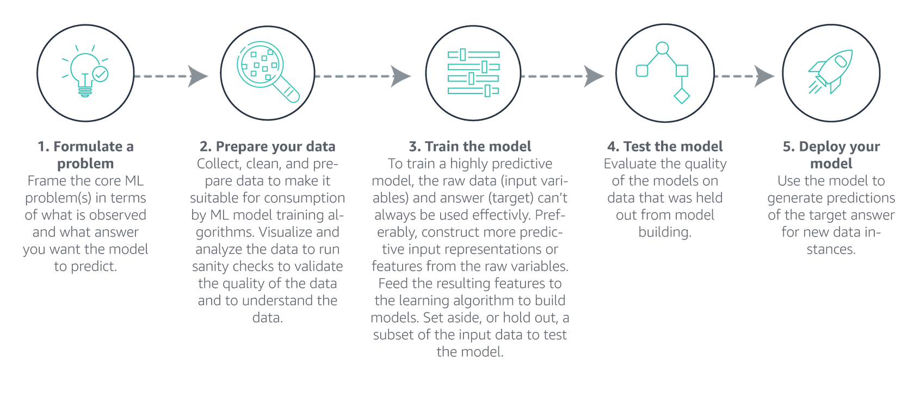
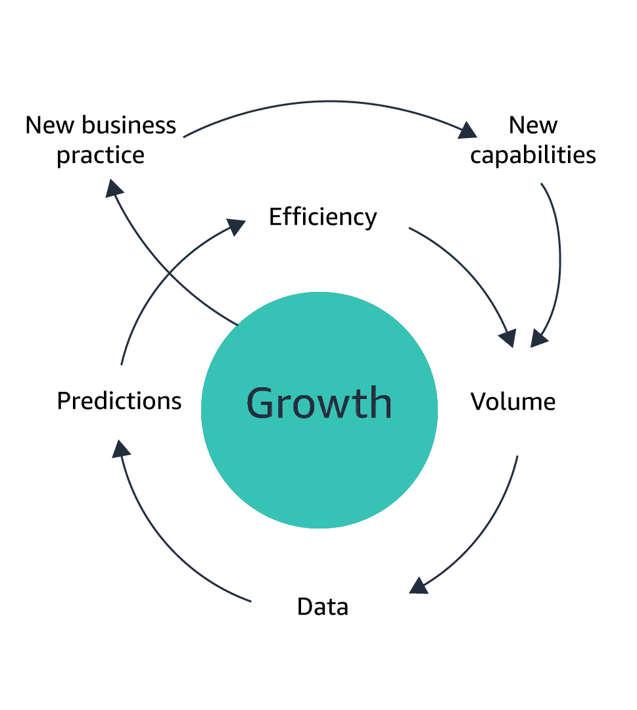

# What is Machine Learning?
It is a process of training computers, using math and statistical processes, to find and recognize patterns in data. After patterns are found, ML generates and updates training models to make increasingly accurate predictions and inferences about future outcomes based on historical and new data.

> E.g.: ML could help determine the likelihood of a Customer purchasing a particular product based on previous purchases by the user or the product's past sales history.

Building ML applications is an iterative process that involves a sequence of steps. To build a ML application, follow these general steps:
1. **Formulate a problem** - Frame the core ML problem(s) in terms of what is observed and what answer you want the model to predict
2. **Prepare your data** - Collect, clean, and prepare data to make it suitable for consumption by ML model training algorithms. Visualize and analyze the data to run sanity checks to validate the quality of the data and to understand the data
3. **Train the model** - To train a highly predictive model, the raw data (input variables) and answer (target) cannot be used effectively. Preferably, construct more predictive input representations or features from the raw variables. Feed the resulting features to the learning algorithm to build models. Ser aside, or hold out, a subset of the input data to test the model.
4. **Test the model** - Evaluate the quality of the models on data that was held out from model building
5. **Deploy your model** - Use the model to generate predictions of the target answer for new data instances

## What are the key terms in ML?
- **Model** - The output of an ML algorithm trained on a data set; used for data prediction
- **Training** - The act of creating a model from past data
- **Testing** - Measuring the performance of a model on test data
- **Deployment** 0 Integrating a model into a production pipeline

### ML flywheel
> **Growth**  
  → New business practice  
    → New capabilities  
      → Volume → Data → Predictions → Efficiency  
  → ...and so on back to **Growth**   

Same as per new business structure and building a new Product model:  
> **Growth**  
  → Lower cost structure  
    → Lower prices  
      → Customer experience → Traffic → Sellers → Selection  
  → ...and so on back to **Growth**

## How is machine learning helping AWS customers?
AWS machine learning services have provided solutions for a variety of customer use cases. AWS ML customers have extracted and analyzed client document data to help speed up critical business decisions and the identification of fraudulent online activities. AWS ML customers forecast their key demand metrics to meet customer demand and reduce waste. These customers have also generated personalized recommendations to maximize customer engagement. Below is a quick overview of various AWS AI, ML, and platform services that customers are using to accelerate business outcomes.

## AI/ML Services
### Amazon Fraud Detector AI/ML Service 1
**Amazon Fraud Detector** - is a fully managed service that makes it easy to identify potentially fraudulent online activities, such as online payment fraud and the creation of fake accounts. Amazon Fraud Detector uses machine learning and 20 years of fraud detection expertise from AWS and Amazon.com to automatically identify potentially fraudulent activity in milliseconds. There are no up-front payments, long-term commitments, or infrastructure to manage with Amazon Fraud Detector. You pay only for your actual usage.

### Amazon Personalize AI/ML Service 2
**Amazon Personalize** - Amazon Personalize makes it easy for developers to build, train, and deploy recommendation models capable of delivering many personalization experiences. Examples include specific real-time product recommendations using existing user profile and item information, personalized product re-ranking, and customized direct marketing.

Since Amazon Personalize uses ML, building a model requires the formatting of input data (uploaded or real-time event data). You select a training algorithm to use on the data, solution model training, and solution deployment. Each training recipe performs feature extraction of your data. It also applies a choice of learning algorithms, along with default learning values used to manage and optimize the machine learning process.

### Amazon Polly AI/ML Service 3
Amazon Polly is a service that turns text into lifelike speech to create applications that talk and build entirely new categories of speech-enabled products. The Amazon Polly text-to-speech (TTS) service uses advanced deep learning technologies to synthesize natural-sounding human speech. With dozens of lifelike voices across a broad set of languages, you can build speech-enabled applications that work in many different countries.

### Amazon Transcribe AI/ML Service 4
As an opposite to Amazon Polly (TTS), the Amazon Transcribe is an AWS service that helps customers convert speech to text (STT). Using automatic speech recognition (ASR) technology, customers can choose to use Amazon Transcribe for a variety of business applications. Examples include the transcription of voice-based customer service calls, generation of subtitles on audio or video content, and conduct (text-based) content analysis on audio or video content.

### Amazon SageMaker AI AI/ML Service 5
Amazon SageMaker AI is a fully managed service that provides every developer and data scientist with the ability to build, train, and deploy models quickly. SageMaker AI removes the heavy lifting from each step of the ML process to make it easier to develop high-quality models.

### Summary
These are just a few of the services that AWS has to offer.  
For more services please visit [Machine Learning page](https://aws.amazon.com/ru/ai/machine-learning/)
